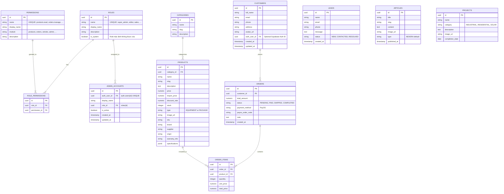

# Nexera Database Management Skill

You are managing the Supabase (PostgreSQL) database for the Nexera platform.

## Core Principles
- **Platform:** Supabase (PostgreSQL).
- **Schema Design:** Normalize data appropriately for an E-commerce + CRM hybrid.
- **Security:** Row Level Security (RLS) is MANDATORY for all tables exposed to the public API (Next.js client).
- **RBAC:** Hệ thống phân quyền dựa trên Role-Based Access Control với bảng `roles`, `permissions`, `role_permissions`.

## Sơ đồ quan hệ thực thể (ERD)



## Chi tiết các bảng (Tables Breakdown)

1. **RBAC (Role-Based Access Control):**
   - `roles`: Định nghĩa vai trò (`super_admin`, `editor`, `sales`, hoặc tự tạo thêm). Role có `is_system=true` không được xóa.
   - `permissions`: Quyền hạn chi tiết theo module. Naming convention: `module.action` (vd: `products.write`, `orders.manage`).
   - `role_permissions`: Bảng trung gian gắn quyền vào vai trò (Many-to-Many).
2. **Authentication & Accounts:**
   - `admin_accounts`: Tài khoản Admin, liên kết `auth.users` và `roles`. Có `is_active` để vô hiệu hóa mà không xóa.
   - `customers`: Thông tin khách hàng Storefront, dùng chung cho cả CRM.
3. **E-commerce:**
   - `categories`: Phân loại sản phẩm.
   - `products`: Thiết bị/gói lắp đặt (có `import_price`, `discount_rate`, `specifications` JSONB).
4. **Order Management:**
   - `orders`: Đơn hàng (`status`, `payos_order_code`, `note`).
   - `order_items`: Chi tiết từng sản phẩm trong đơn.
5. **CRM:**
   - `leads`: Dữ liệu Form Tư vấn.
6. **Content (CMS):**
   - `articles`: Tin tức, blog.
   - `projects`: Dự án tiêu biểu.

## Default Permissions Matrix

| Permission | super_admin | editor | sales |
|---|:---:|:---:|:---:|
| `dashboard.view` | ✅ | ✅ | ✅ |
| `products.read/write/delete` | ✅ | ✅ | read only |
| `categories.read/write/delete` | ✅ | ✅ | ❌ |
| `orders.read/manage` | ✅ | ❌ | ✅ |
| `customers.read/write` | ✅ | ❌ | ✅ |
| `leads.read/manage` | ✅ | ❌ | ✅ |
| `articles.read/write/delete` | ✅ | ✅ | ❌ |
| `projects.read/write/delete` | ✅ | ✅ | ❌ |
| `admin.manage_users/roles/settings` | ✅ | ❌ | ❌ |

## Helper Function

Dùng hàm `has_permission()` trong RLS hoặc application code:
```sql
-- Kiểm tra user hiện tại có quyền 'products.write' không
SELECT has_permission('products.write');
```

## Security Guidelines (RLS)
- **Public Read:** `products`, `articles`, `projects` — cho phép `SELECT` công khai.
- **Admin Write:** Dùng `has_permission()` để kiểm tra quyền trước khi cho `INSERT/UPDATE/DELETE`.
- **User Isolation:** Customer chỉ xem `orders` và `customers` record của mình.
- **Admin Isolation:** Chỉ `super_admin` quản lý `roles`, `permissions`, `admin_accounts`.

## Common Workflows
- **Writing Migrations:** Generate standard PostgreSQL `CREATE TABLE`. Dùng `UUID` PK, `TIMESTAMPTZ` dates.
- **Enabling Security:** Luôn `ALTER TABLE ... ENABLE ROW LEVEL SECURITY;` + `CREATE POLICY`.
- **Checking Admin Access:** `SELECT * FROM admin_accounts WHERE auth_user_id = auth.uid() AND is_active = true`.
- **Checking Permission:** `SELECT has_permission('module.action')`.
- **Adding New Permission:** INSERT vào `permissions`, rồi INSERT vào `role_permissions` để gắn cho role phù hợp.
