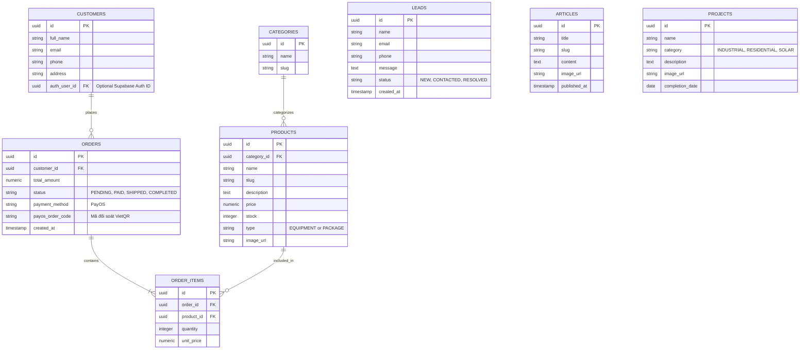

# Nexera Database Management Skill

You are managing the Supabase (PostgreSQL) database for the Nexera platform.

## Core Principles
- **Platform:** Supabase (PostgreSQL).
- **Schema Design:** Normalize data appropriately for an E-commerce + CRM hybrid.
- **Security:** Row Level Security (RLS) is MANDATORY for all tables exposed to the public API (Next.js client).

## Sơ đồ quan hệ thực thể (ERD)

## Chi tiết các bảng (Tables Breakdown)

1. **E-commerce:**
   - `categories`: Phân loại sản phẩm (Tấm pin, Biến tần...).
   - `products`: Thông tin thiết bị/gói lắp đặt (có cột `type`).
2. **Order Management:**
   - `orders`: Đơn hàng tổng quát (`status`, `payos_order_code`).
   - `order_items`: Chi tiết mua sản phẩm nào, giá bao nhiêu.
3. **CRM:**
   - `customers`: Thông tin khách mua.
   - `leads`: Hứng dữ liệu Form Tư vấn cho Sale.
4. **Content (CMS):**
   - `articles`: Tin tức, blog.
   - `projects`: Dự án tiêu biểu.

## Security Guidelines (RLS)
- **Public Read Access:** Tables like `products`, `articles`, and `projects` should have an RLS policy allowing `SELECT` for anonymous/authenticated users.
- **Restricted Write Access:** Only authenticated users with an 'admin' role (or the NestJS backend using a Service Role Key) can `INSERT`, `UPDATE`, or `DELETE` products and content.
- **User Isolation:** A logged-in customer should only be able to `SELECT` their own `orders`.

## Common Workflows
- **Writing Migrations:** When asked to create a table, generate a standard PostgreSQL `CREATE TABLE` script. Include appropriate data types (e.g., `UUID` for primary keys, `TIMESTAMPTZ` for dates).
- **Enabling Security:** Always output the `ALTER TABLE tablename ENABLE ROW LEVEL SECURITY;` command along with the specific `CREATE POLICY` statements.
